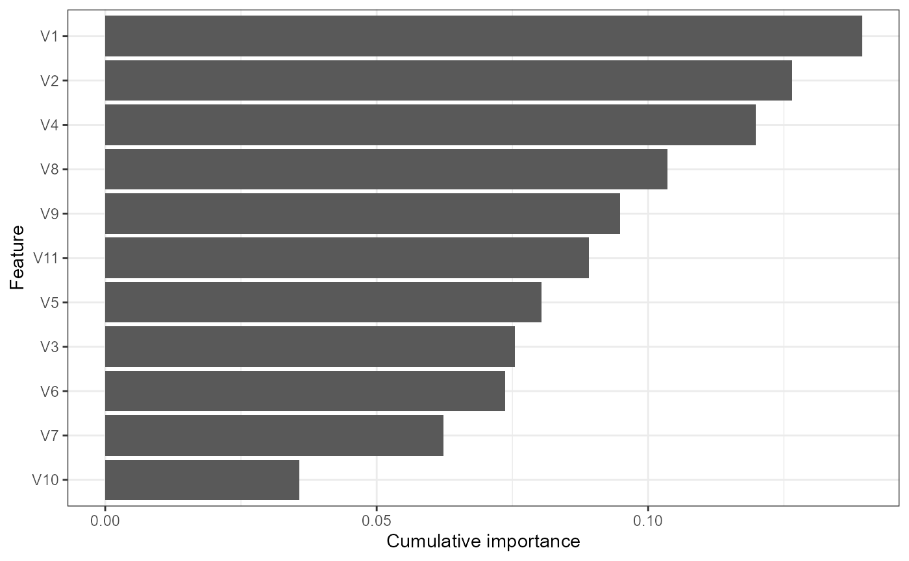

# mrIML: Multivariate--multi-response--interpretable machine learning 


Author: **Nick Fountain-Jones**
  -affiliation: **University of Tasmania**
  
Author: **Gustavo Machado**
  -affiliation: **North Carolina State University**
  -Lab page: https://machado-lab.github.io/
  
<!-- badges: start -->


<!-- badges: end -->

This package aims to enable users to build and interpret multivariate
machine learning models harnessing the tidyverse (tidy model syntax in
particular). This package builds off ideas from Gradient Forests (Ellis
et al 2012), ecological genomic approaches (Fitzpatrick and Keller,
2014) and multi-response stacking algorithms (Xing et al 2019).

This package can be of use for any multi-response machine learning
problem, but was designed to handle data common to community ecology
(site by species data) and ecological genomics (individual or population
by SNP loci).

## <i class="fas fa-cog"></i> Installation

The current developmental version can be installed with

``` r
#install.packages("devtools")
devtools::install_github('nfj1380/mrIML')
```

### <i class="fas fa-skull-crossbones"></i> Dealing with Errors

There are automatic checks for
[**mrIML**](https://travis-ci.org/github//mrIML/branches).
However, that only checks for Linux and **mrIML** is built on Windows.

## <i class="fas fa-star"></i> Quick start

**mrIML** is designed to be used with a single function call or to be
used in an ad-hoc fashion via individual function calls. In the
following section we give an overview of the simple use case. For more
on using each function see the [function documentation](https://nfj1380.github.io/mrIML/reference/index.html). The core
functions for both regression and classification are:
[`mrIMLpredicts`](https://nfj1380.github.io/mrIML/reference/mrIMLpredicts.html), [`mrIMLperformance`](https://nfj1380.github.io/mrIML/reference/mrIMLperformance.html), and
[`mrInteractions`](https://nfj1380.github.io/mrIML/reference/mrInteractions.html),for plotting and visualization [`mrVip`](https://nfj1380.github.io/mrIML/reference/mrVip.html),
[`mrFlashlight`](https://nfj1380.github.io/mrIML/reference/mrFlashlight.html), and[`plot_vi`](https://nfj1380.github.io/mrIML/reference/plot_vi.html). Estimating the interactions
alone can be substantially computationally demanding depending on the
number of outcomes you want to test. The first step to using the package
is to load it as follows.

``` r
library(mrIML)

#other package needed:
library(vip); library(tidymodels); library(randomForest);  library(caret); library(gbm);
library(tidyverse);library(parallel); library(doParallel); library(themis); library(viridis);
library(janitor); library(hrbrthemes); library(xgboost); library(vegan);library(flashlight);
library(ggrepel); library(parsnip);library(rsample); library(workflows)
```


## <i class="fas fa-cog"></i> Model component

Now all the data is loaded and ready to go we can formulate the model using tidymodel syntax. In this case we have binary data (SNP presence/absence at each loci) but the data could also be counts or continuous (the set_model argument would be "regression" instead of "classification"). The user can specify any model from the tidymodel universe as 'model 1' (see https://www.tidymodels.org/find/ for details). However, we have done most of our testing on random forests (rf), xgr boost and glms (generalized linear models). Here we will specify a random forest classification model as the model applied to each response.


```r 
model1 <- 
  rand_forest(trees = 100, mode = "classification") %>% #100 trees are set for brevity
  set_engine("ranger", importance = c("impurity","impurity_corrected")) %>%# select the engine/package that underlies the model
  set_mode("classification")# choose either the continuous "regression" or binary "classification" mode
```
 
### [mrIMLpredicts](https://nfj1380.github.io/mrIML/reference/mrIMLpredicts.html)

This function represents the core functionality of the package and
includes results reporting, plotting and optional saving.  It requires a
data frame of X the loci or snip data for exampel and Y represented by the covariates

Load example data (cite) data from `{mrIML}`.

``` r
data <- gfData[1:80]
head(data)
        x     y bio_1 bio_10 bio_15 bio_18 bio_2 bio_7 elevation     MEM.1      MEM.2      MEM.3       MEM.4
1 -101.57 49.14    31    182     63    189   131   489       498  24.55053   7.444415  -9.018635  0.06879434
2 -147.89 69.10  -107     85     60     89   110   507       400 -14.18000 -22.945314 -11.845836 21.59719769
3 -148.51 63.39   -52     90     63    196   102   399      1040 -15.77654 -27.420568 -13.038813 14.65433486
4  -98.35 54.51   -12    159     52    204   103   510       213  20.73482   8.715802 -19.187171 -5.13771830
```
``` r
# Define set of features
FeaturesnoNA<-Features[complete.cases(Features), ]
Y <- FeaturesnoNA #for simplicity
# Define set the outcomes of interst
fData <- filterRareCommon (Responsedata, lower=0.4, higher=0.7) 
X <- fData #

yhats <- mrIMLpredicts(X=X,Y=Y, model1=model1, balance_data='no', mod='classification', parallel = TRUE)
#save(yhats, file='logreg_model')
ModelPerf <- mrIMLperformance(yhats, model1, X=X) #
ModelPerf[[2]]
```

## Ploting
```r
VI <- mrVip(yhats, Y=Y) 
plot_vi(VI=VI,  X=X,Y=Y, modelPerf=ModelPerf, cutoff= 0, plot.pca='yes') #the cutoff reduces the number of individual models printed in the second plot. 

```



## Effect of a feature on genetic change

We also wrap some flashlight functionality to visualize the marginal (i.e. partial dependencies) or conditional (accumulated local effects) effect of a feature on genetic change. Partial dependencies take longer to calculate and are more sensitive to correlated features

```r

flashlightObj <- mrFlashlight(yhats, X, Y, response = "multi", model='classification')

#plot prediction scatter for all responses. Gets busy with 
plot(light_scatter(flashlightObj, v = "Forest", type = "predicted"))

#plots everything on one plot (partial dependency, ALE, scatter)
plot(light_effects(flashlightObj, v = "Grassland"), use = "all")


#profileData_pd <- light_profile(flashlightObj,  v = "Grassland")

#mrProfileplot(profileData_pd , sdthresh =0.05) #sdthresh removes responses from the first plot that do not vary with the feature

profileData_ale <- light_profile(flashlightObj, v = "Grassland", type = "ale") #acumulated local effects

mrProfileplot(profileData_ale , sdthresh =0.01)
#the second plot is the cumulative turnover function

```

## Features interact

Finally, we can assess how features interact overall to shape genetic change. Be warned this is memory intensive. Future updates to this package will enable users to visualize these interactions and explore them in more detail using 2D ALE plots for example.

```r 

interactions <-mrInteractions(yhats, X, Y,  mod='classification') #this is computationally intensive so multicores are needed. If stopped prematurely - have to reload things

mrPlot_interactions(interactions, X,Y, top_ranking = 2, top_response=2)

````

## <i class="fas fa-pen-square"></i> References

Xing, L, Lesperance, ML and Zhang, X (2020). Simultaneous prediction of
multiple outcomes using revised stacking algorithms. Bioinformatics, 36,
65-72.

Fitzpatrick, M.C. & Keller, S.R. (2015) Ecological genomics meets
community-level modelling of biodiversity: mapping the genomic landscape
of current and future environmental adaptation. Ecology Letters 18,
1–16.

Ellis, N., Smith, S.J. and Pitcher, C.R. (2012), Gradient forests:
calculating importance gradients on physical predictors. Ecology, 93:
156-168. <doi:10.1890/11-0252.1>
